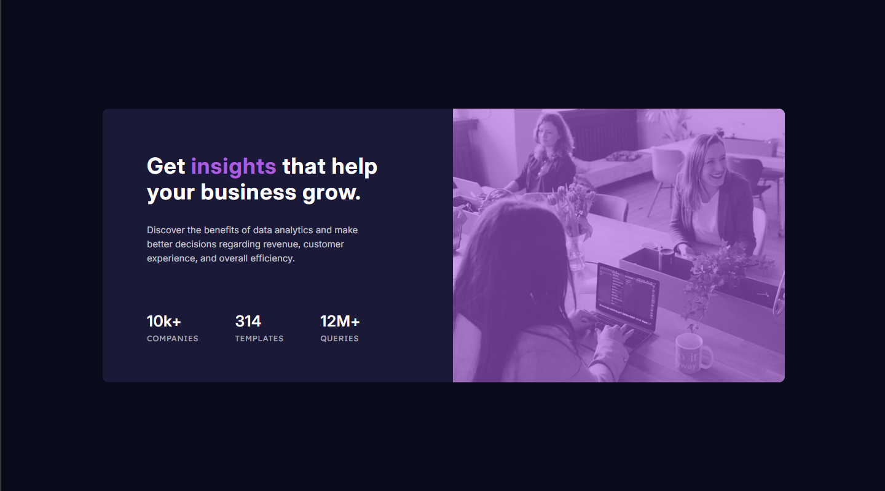
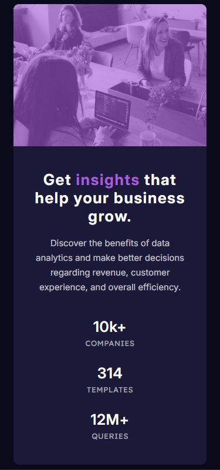

# Frontend Mentor - Solução de componente de cartão de pré-visualização de estatísticas

Esta é uma solução para o [desafio de componente de cartão de pré-visualização de estatísticas no Frontend Mentor](https://www.frontendmentor.io/challenges/stats-preview-card-component-8JqbgoU62). Os desafios do Frontend Mentor ajudam você a melhorar suas habilidades de codificação ao criar projetos realistas.

## Índice

- [Visão geral](#visão-geral)
- [O desafio](#o-desafio)
- [Captura de tela](#captura-de-tela)
- [Links](#links)
- [Meu processo](#meu-processo)
- [Construído com](#construído-com)
- [O que aprendi](#o-que-aprendi)
- [Autor](#autor)

## Visão geral

### O desafio

Os usuários devem ser capazes de:

- Visualizar o layout ideal dependendo do tamanho da tela do dispositivo

### Captura de tela

[](https://github.com/JottaCa/stats-preview-card-component/blob/main/design/desktop-design.png)

[](https://github.com/JottaCa/stats-preview-card-component/blob/main/design/mobile-disign.png)


### Links

- URL da solução: [https://github.com/JottaCa/stats-preview-card-component](https://github.com/JottaCa/stats-preview-card-component)
- URL do site ativo: [https://jottaca.github.io/stats-preview-card-component/](https://jottaca.github.io/stats-preview-card-component/)

## Meu processo

### Criado com

- Marcação HTML5 semântica
- Propriedades personalizadas CSS
- Flexbox
- Fluxo de trabalho desktop-first

### O que aprendi

Ao concluir este projeto do Frontend Mentor, aperfeiçoei diversas habilidades essenciais para o desenvolvimento frontend. Utilizei Flexbox para criar layouts responsivos e bem estruturados, além de aprimorar minha experiência com design responsivo, garantindo que as páginas se adaptem perfeitamente a diferentes dispositivos, como no trecho de código a seguir:

```html
<picture class="image-card">
  <source media="(max-width: 580px)" srcset="./src/images/image-header-mobile.jpg">
  <source media="(max-width: 1110px)" srcset="./src/images/image-header-mediun.jpg">
  
</picture>
```

Também explorei o uso de pseudo-elementos, como ::after, para adicionar estilos e elementos extras sem modificar o HTML: 

```css
.preview-card .image-card::after {
    content: "";
    position: absolute;
    background-color: var(--destaque);
    opacity: .6;
    width: 100%;
    height: 100%;
    top: 0;
    left: 0;
    border-top-right-radius: 10px;
    border-bottom-right-radius: 10px;
    z-index: 1;
}
```

Ainda, desenvolvi boas práticas de controle de versão utilizando Git, e organizei meu código de forma a facilitar a manutenibilidade.

## Autor

- Site - [Jonathan Barbosa](https://jottaca.github.io/portfolio/m)
- Mentor de front-end - [@devemdobro](https://github.com/devemdobro/devemdobro)